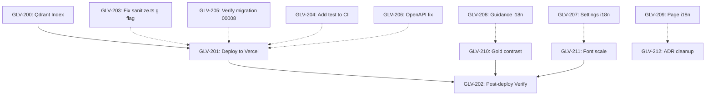

# Sprint 4: Operations & Hardening Kanban

**Sprint**: 2026-06-25 | **Phase**: Production Ops | **Status**: 🔄 IN PROGRESS

---

## Sprint Goal

Deploy to Vercel production, apply Qdrant payload index, and harden remaining security/quality gaps discovered during Sprint 3 audit.

---

## Audit Score: 82/100 → Target: 90/100

| Severity | Issue | Area | Status |
|----------|-------|------|--------|
| 🔴 CRITICAL | CI pipeline doesn't run `npm test` — can deploy with broken tests | CI | 🆕 PENDING |
| 🟠 HIGH | Qdrant payload index not applied to production | Qdrant | 🆕 PENDING |
| 🟠 HIGH | Migration 00008 may not be applied to production Supabase | DB | 🆕 PENDING |
| 🟠 HIGH | `g` flag bug in `sanitize.ts` — `RegExp.test()` with `g` flag mutates `lastIndex` | Security | 🆕 PENDING |
| 🟡 MEDIUM | ~200+ hardcoded English strings not using `t()` i18n | i18n | 🆕 PENDING |
| 🟡 MEDIUM | Gold contrast: `text-accent-gold/60` on body text fails WCAG AA | UI/A11y | 🆕 PENDING |
| 🟡 MEDIUM | Deploy to Vercel production and verify | Ops | 🆕 PENDING |
| 🔷 LOW | OpenAPI spec lists `apiKey` in `ExplainRequest` (runtime rejects it) | Docs | 🆕 PENDING |
| 🔷 LOW | ADR-005/ADR-006 duplicates of ADR-003/ADR-004 | Docs | 🆕 PENDING |
| 🔷 LOW | README.md test count stale (302→309) | Docs | 🆕 PENDING |

---

## Phase 1: 🔴 Immediate Ops (Run Now)

| # | Ticket | Description | Est | Status |
|---|--------|-------------|-----|--------|
| **GLV-200** | Run Qdrant payload index script against production | `cd nextjs && node scripts/create-qdrant-index.js` with production QDRANT_URL + QDRANT_API_KEY | 5min | 🔄 PENDING |
| **GLV-201** | Deploy to Vercel production | `cd nextjs && npx vercel --prod` | 10min | 🔄 PENDING |
| **GLV-202** | Post-deploy verification | Check site loads, search works, diagnostics pass, auth works, law detail loads | 15min | 🔄 PENDING |

## Phase 2: 🟠 Security & Infrastructure Fixes

| # | Ticket | Description | Est | Status |
|---|--------|-------------|-----|--------|
| **GLV-203** | Fix `g` flag bug in `sanitize.ts` | Remove `g` flag from all 6 regex patterns in `API_KEY_PATTERNS` | 5min | 🆕 PENDING |
| **GLV-204** | Add `npm test` to `ci.yml` | Insert `- run: npm test` between lint and build steps | 5min | 🆕 PENDING |
| **GLV-205** | Verify migration 00008 applied to production DB | Run SQL: check triggers on 4 tables + 3 indexes | 10min | 🆕 PENDING |
| **GLV-206** | Fix OpenAPI `ExplainRequest` schema | Remove `apiKey` property from OpenAPI spec | 5min | 🆕 PENDING |

## Phase 3: 🟡 Quality & i18n Expansion

| # | Ticket | Description | Est | Status |
|---|--------|-------------|-----|--------|
| **GLV-207** | Add `t()` i18n to settings page | ~50 strings: mode labels, config, limitations, help texts | 30min | 🆕 PENDING |
| **GLV-208** | Add `t()` i18n to guidance paths display | ~30 strings: tips, labels, disclaimers, analysis headers | 20min | 🆕 PENDING |
| **GLV-209** | Add `t()` i18n to home page + law detail + bookmarks | ~30 strings across 3 pages | 30min | 🆕 PENDING |
| **GLV-210** | Fix gold contrast on `text-accent-gold/60` | Replace with `text-accent-gold-body` or `text-accent-gold-body/80` in law-card, session pages, api-docs | 15min | 🆕 PENDING |
| **GLV-211** | Remove `text-[13px]` arbitrary sizes | Replace with `text-sm` or theme tokens | 10min | 🆕 PENDING |

## Phase 4: 🔷 Docs Cleanup

| # | Ticket | Description | Est | Status |
|---|--------|-------------|-----|--------|
| **GLV-212** | Consolidate ADR-005 into ADR-003, ADR-006 into ADR-004 | Mark duplicates as superseded | 10min | 🆕 PENDING |
| **GLV-213** | Update README.md test count | 302/37 → 309/38 | 5min | 🆕 PENDING |

---

## Definition of Done

- [ ] All code compiles without errors (`tsc --noEmit`)
- [ ] All tests pass (`npm test`)
- [ ] Qdrant payload index applied to production (`german_norms.law_key`)
- [ ] Production build succeeds on Vercel
- [ ] Post-deploy smoke tests pass (search, auth, law detail, diagnostics)
- [ ] `sanitize.ts` `g` flag removed
- [ ] `ci.yml` runs `npm test`
- [ ] Migration 00008 verified on production DB
- [ ] OpenAPI spec consistent with runtime

## Dependencies

- Solid arrows: hard dependency (must complete first)
- Dashed arrows: soft dependency (should complete before deploy but not blocking)
